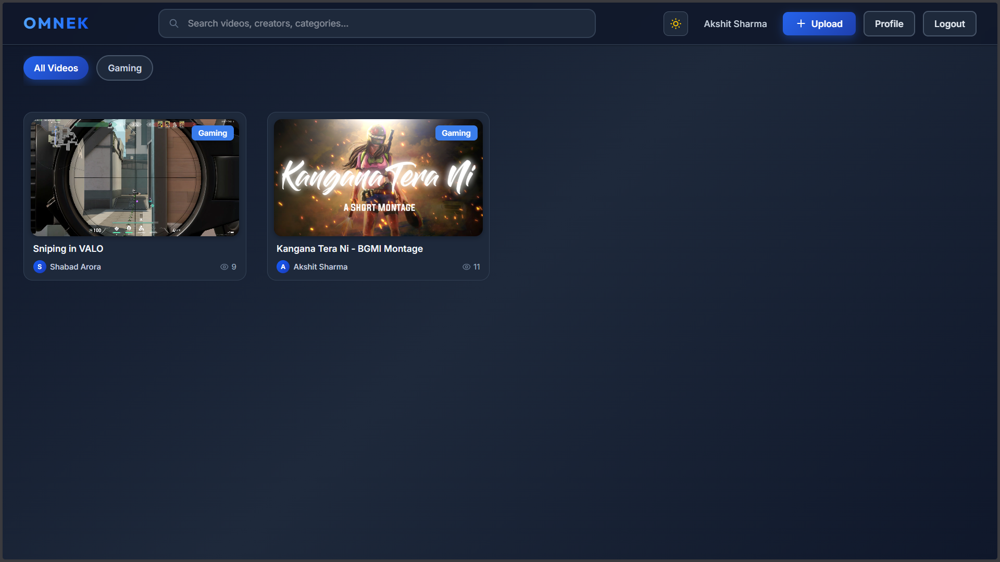
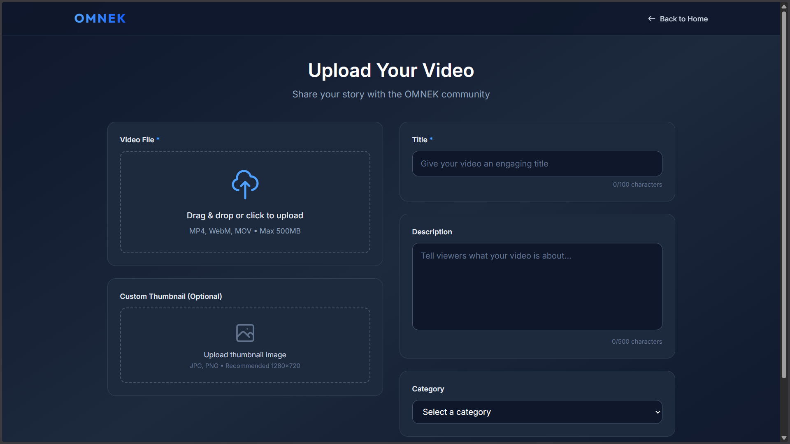
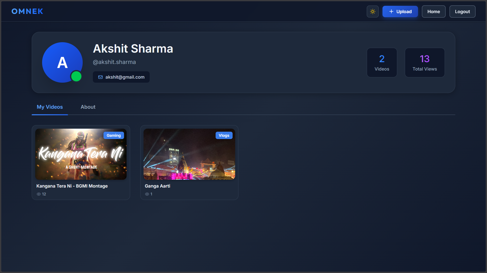

<div align="center">

# 🎬 **OMNEK — Scalable Video Content Delivery Platform**


<br>
<br>

🔗 <strong>Live Demo: https://omnek.onrender.com </strong>
<br>

### 🚀 *A scalable platform for streaming and delivering video content efficiently.*

</div>

<p align="center">

<a href="https://github.com/akshitsharma-git/omnek/stargazers">
  
</a>

<a href="https://github.com/akshitsharma-git/omnek">
  
</a>

<a href="https://github.com/akshitsharma-git/omnek/commits">
  
</a>

<br>


</p>

---

# 📌 **Overview**

OMNEK is a **scalable video content delivery platform** designed to handle modern media streaming needs.

It focuses on **efficient video delivery**, **clean user experience**, and a **production-ready full-stack architecture**, making it suitable for real-world content platforms.

---

# ✨ **Features**

- 🎥 **Video streaming and playback**
- 📦 **Scalable content delivery architecture**
- 🎨 **Clean and minimal UI**
- 🚀 **Production-ready backend**
- 🌐 **Web-based access**
- ☁️ **Deployed on Render**

---

# 📸 **Demo Preview**




---

# 🛠 **Tech Stack**

| Layer | Technology |
|------|------------|
| **Frontend** | React.js, CSS |
| **Backend** | Node.js, Express.js |
| **Video Storage** | Cloudinary |
| **Deployment** | Render |
| **Version Control** | Git + GitHub |

---

# 🔍 **How It Works**

1. User accesses the platform  
2. Video content is fetched from Cloudinary via the backend
3. Streamed efficiently to the client  
4. Player handles playback seamlessly  

---

# 📁 **Project Structure**

```bash
OMNEK/
│
├── BackEnd/
│   ├── controllers/
│   ├── models/
│   ├── routes/
│   ├── services/
│   ├── index.js
│   ├── package.json
│   ├── package-lock.json
│   ├── .env
│   ├── .env.example
│   └── .gitignore
│
├── FrontEnd/
│   ├── src/
│   ├── index.html
│   ├── vite.config.js
│   ├── eslint.config.js
│   ├── package.json
│   ├── package-lock.json
│   ├── .env.local
│   ├── .env.production
│   └── .gitignore
│
└── README.md

```

---

# ⚙️ **Environment Variables**

### `.env` in BackEnd Folder

```bash
PORT=9999
MONGO_URL=your_mongodb_connection_string
SECRET_KEY=your_secret_key
CLOUDINARY_CLOUD_NAME=your_cloudnairy_name
CLOUDINARY_API_KEY=your_cloudnairy_api_key
CLOUDINARY_API_SECRET=your_cloudnairy_api_secret

```
---

# 💻 **Local Development Setup**

### For Backend 
```bash
cd BackEnd 
npm install
npm start
```

### For Frontend 
```bash
cd FrontEnd
npm install
npm run dev
```
---

# 🧠 **Philosophy**

> Content should scale. Delivery should not fail.

OMNEK is built with a focus on **scalability**, **performance**, and **clarity**, ensuring video content is delivered reliably without unnecessary complexity.

---

# 📜 **License**

This project is licensed under the **MIT License**.

---

<div align="center">
  <strong>If you like this project, please consider giving it a star ⭐</strong>
</div>

<br>

<p align="center">Made with ❤️ by Akshit Sharma</p>

